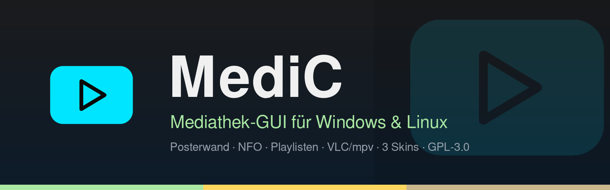
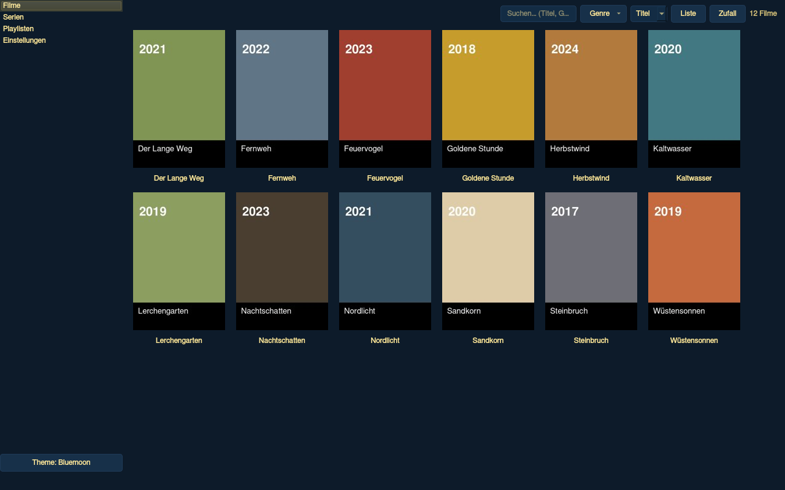
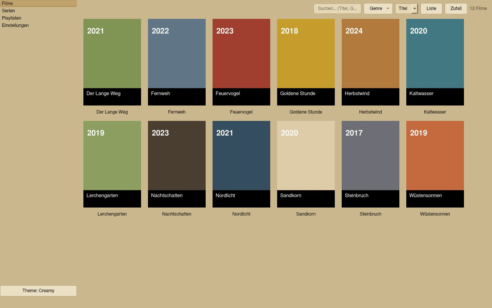

<div align="center">



# MediC

**Mediathek-GUI für Windows &amp; Linux** — Posterwand, NFO-Unterstützung,
Playlisten und Wiedergabe über externe Player wie VLC oder mpv.

**[⬇ Download (aktuelle Version)](https://github.com/cvinz78/MediC/releases/latest)** · [Lizenz: GPL-3.0](LICENSE)

</div>

---

**MediC** (von *MediaCenter*) liest lokale Medienordner ein, zeigt Filme und
Serien als Posterwand und übergibt die Wiedergabe an den externen Player deiner Wahl
(Standard: VLC). Vorhandene Metadaten- und Bilddateien — `movie.nfo`, `tvshow.nfo`,
Poster, Fanart, Trailer, Untertitel — werden ohne Konvertierung genutzt. Es werden **niemals Dateien
deiner Mediathek verändert oder gelöscht**, die App schreibt ausschließlich in ihren
eigenen Datenordner.

---

## Screenshots — die drei Skins

| Darkskin (Standard) | Bluemoon | Creamy |
|---|---|---|
|  |  |  |

Der Skin lässt sich jederzeit umschalten — per **Theme-Button unten links** (klickt durch
alle drei) oder unter **Einstellungen → Ansicht**. Der Wechsel wirkt sofort, ohne Neustart.
*(Screenshots zeigen eine Beispieldatenbank.)*

---

## Funktionen

### Bibliotheken & Scan
- **Mehrere Bibliotheken** konfigurierbar (Name, Typ, Pfad) — beliebig viele Unterordner rekursiv
- **Eigene Kategorien** neben „Filme“ und „Serien“ (z. B. „Doku“, „Comedy“) — jede Kategorie bekommt einen eigenen Eintrag in der Navigation
- **Auto-Klassifikation**: Ordner mit Serienstruktur (`tvshow.nfo`, `SxxEyy`) landen automatisch in der Serien-Ansicht — auch innerhalb von Film-/Kategorie-Bibliotheken
- **Inkrementeller Scan**: unveränderte Einträge (mtime + Pfad) werden nicht neu eingelesen
- Scan läuft im **Hintergrund-Thread** mit Fortschritt in Prozent, aktueller Datei und **Abbrechen-Button**
- **Netzwerk-Mounts** (NFS/SMB): langsame Scans sind kein Problem, IO-Fehler (Mount weg) werden als Warnung behandelt statt den Scan abzubrechen
- Verschwundene Dateien räumt der Scan aus der Mediathek auf — **nur aus der Datenbank, nie von der Festplatte**

### NFO-Metadaten & Datei-Erkennung
- NFO-Parsing: `movie.nfo`, `tvshow.nfo`, Episoden-NFOs — inkl. UTF-8 mit BOM, Fallback latin-1, XML ab beliebiger Zeile, doppelte `<movie>`-Blöcke, modernes `<ratings>`-Format; unbekannte Tags werden ignoriert
- Erkannt werden: Titel, Sortier-Titel, Plot, Jahr, Bewertung, Laufzeit, Genres, Studio, Regisseur, Darsteller, Poster, Fanart, Trailer, Staffel/Episode/Ausstrahlungsdatum
- Poster/Fanart/Banner/Staffel-Poster/Trailer/Untertitel nach dem gängigen NFO-Schema (Tabelle unten)

### Posterwand & Ansichten
- **Klick auf ein Poster = Film startet** im Standard-Player
- **Rechtsklick = Kontextmenü**: Abspielen, Trailer abspielen, Details/Medieninfos, Zur Playlist hinzufügen, Ordner öffnen, Metadaten neu einlesen, Aus Bibliothek entfernen
- **Posterwand ↔ Liste** umschaltbar (Filme, Serien und eigene Kategorien; Serien-Liste mit Titel/Jahr/Bewertung)
- **4 Postergrößen** (Klein/Mittel/Groß/Sehr groß), Titel unter dem Poster an/aus
- **Live-Suche** über Titel, Genre und Jahr — inkl. Jahresbereichen (`1977-2005`, `1977-`, `-2005`)
- **Genre-Filter mit Zählern** — getrennt je Ansicht (Filme-Seite zeigt nur Film-Genres usw.)
- **Sortierung** nach Titel oder Jahr
- **„Zufall“-Button**: spielt einen zufälligen Film bzw. eine zufällige Episode — bei aktivem Filter aus den gefilterten Einträgen, in der Staffel-/Episoden-Ansicht aus der aktuell geöffneten Serie/Staffel

### Serien-Ansicht (3 Ebenen)
- Ebene 1: Posterwand aller Serien → Ebene 2: Staffeln + Serieninfos (Fanart-Hintergrund) → Ebene 3: Episodenliste mit Thumbnails
- **Breadcrumb-Navigation** (Serien › Show › Staffel), `Esc` geht eine Ebene zurück
- Ganze Serien oder einzelne Staffeln abspielen (temporäre M3U8 an den Player) oder in Playlisten aufnehmen

### Detail-Dialog (Medieninfos)
- Großes Poster, abgedunkeltes Fanart als Hintergrund, Sternebewertung
- Jahr, Bewertung, Laufzeit, Genres, Studio, Regisseur, Darsteller, vollständiger Plot
- Abschnitt „Dateien“: Videopfad, gefundene Untertitel (**anklickbar** → Wiedergabe mit diesem Untertitel), Trailer-Quelle

### Wiedergabe & Player
- **Standard-Player: VLC** — automatische Erkennung unter Linux (`$PATH` → `/usr/bin` → `/usr/local/bin` → `/snap/bin` → Flatpak) und Windows (`$PATH` → Registry → Programmordner)
- Weitere Player frei konfigurierbar (mpv, SMPlayer, Celluloid …) mit Argument-Vorlagen `{file}` und `{subtitle}`
- **Vollbild** optional (Einstellung, Standard: aus)
- **Untertitel** werden per `--sub-file` an VLC/mpv übergeben
- **Trailer**: lokale Trailerdatei wird bevorzugt; YouTube-URL öffnet den Browser (oder VLC, einstellbar)
- Player nicht gefunden → Dialog mit Pfadeingabe statt stillem Abbruch
- Der Player startet als eigener Prozess — die App bleibt bedienbar

### Playlisten
- Eigene Ansicht: Playlisten anlegen/umbenennen/löschen, Einträge mit **↑/↓** sortieren
- Einträge: **Filme, Episoden, ganze Serien und Staffeln** (Duplikate erlaubt)
- **Export als M3U8 / M3U / XSPF**, Import von M3U/M3U8
- Wiedergabe über temporäre M3U8 an den Player

### Tastenkürzel
Alle Hauptaktionen sind **editierbar** (Einstellungen → Tastenkürzel, mit Kollisionsprüfung
und „Alle zurücksetzen“). Standard-Belegung:

| Aktion | Taste |
|---|---|
| Abspielen | `Enter` |
| Details/Medieninfos | `i` |
| Trailer abspielen | `t` |
| Suche fokussieren | `Strg+F` |
| Bibliotheken scannen | `F5` |
| Zurück (Dialog/Ebene) | `Esc` |
| Eintrag aus Playlist entfernen | `Entf` |

### Thumbnails ohne NFO/Poster
- Ohne NFO/Poster dient ein **Frame aus dem Video selbst** als Poster (braucht `ffmpeg`, wird automatisch erkannt — optional)
- Der **Dateiname wird zum Titel** (inkl. Jahreszahl-Erkennung)
- Ohne ffmpeg: gerenderter Platzhalter im Skin-Farbdesign
- Thumbnail-Cache im Datenordner — auch sehr große Bibliotheken (1000+) bleiben flott, Ansicht lädt lazy

### Weitere Details
- **3 Skins**: Darkskin, Bluemoon, Creamy (siehe Screenshots oben)
- **Fenstergröße/Position/Maximierung wird gemerkt**
- „Ordner öffnen“ via `xdg-open` (Linux) bzw. Windows-Explorer
- **Scrollbar-Farben je Skin**: Griff immer sichtbar in der Textfarbe des Skins
- Fehlende Videodateien werden angezeigt/markiert; Berechtigungsfehler (NTFS/externe Platten) brechen den Scan nie ab
- Große/extreme Bilddateien werden beim Rendern runterskaliert, abgeschnittene Bilder soweit möglich angezeigt

---

## Download & Installation

Fertige Builds gibt es in den
**[Releases](https://github.com/cvinz78/MediC/releases/latest)**:

| Datei | Plattform | Was es ist |
|---|---|---|
| `MediC-windows-x64.exe` | Windows 10/11 (x64) | **Installer — enthält beide Varianten in einer Datei:** beim Start wählt man **„Installieren“** (Programmordner, Startmenü-Verknüpfung, Eintrag unter „Programme und Features“ mit Deinstallation) oder **„Portable entpacken“** (Programmordner ohne Verknüpfungen/Registry — ideal z. B. für den USB-Stick). Die App-EXE heißt danach `MediaCenterx64.exe` |
| `MediC-linux-x64` | Linux (x64) | Eine einzelne ausführbare Datei — kein Python/pip nötig, nur einen Desktop mit VLC/mpv |

> **Windows ohne Installation:** Wer nichts installieren möchte, führt die
> `MediC-windows-x64.exe` aus und wählt **„Portable entpacken“** — der Installer
> kopiert dann nur den Programmordner in ein eigenes Verzeichnis der eigenen Wahl.
> Gestartet wird über die `MediaCenterx64.exe` in diesem Ordner; deinstallieren
> = Ordner löschen.

**SHA-256 (Version 1.5):**

```
e3f65af3df60df69c618cae01a0c39bca7774622f53ce14c093c8e741faef9e5  MediC-windows-x64.exe
d9ca54c1675c2882a4a623983cfcf099ce2bb7954af93b50bae52362124f83c3  MediC-linux-x64
```

**Hinweise:**
- **Windows**: Da die EXE unsigniert ist, meldet SmartScreen beim ersten Start „Weitere
  Informationen → Trotzdem ausführen“ — das ist bei selbst gebauten PyInstaller-EXEs normal.
- **Linux**: `chmod +x MediC-linux-x64` und starten. Die Anwendung entpackt sich **einmalig**
  nach `/tmp/MediaCenter/<Version>` (Smart-Cache) und startet danach sofort von dort; nichts
  wird beim Beenden gelöscht, neu entpackt wird nur bei geleertem Ordner oder älterer Version.
- **Windows 7 SP1/8.1**: Qt 6 läuft dort nicht — eine Win7-Variante (PyQt5) ist in diesem
  Release nicht enthalten.

---

## Selbst bauen

Der komplette Quellcode der App liegt im Repo — die Anwendung ist bewusst **eine einzige
Python-Datei**. Zum Bauen aller drei Varianten ist genau dieses Set nötig:

| Datei | Zweck |
|---|---|
| `mediacenter.py` | die komplette App als Einzeldatei (Quelle für Windows; läuft auch direkt per `python mediacenter.py`) |
| `installer.py` | Windows-Installer (bietet „Installieren“ und „Portable entpacken“) |
| `build_windows.bat` | Komplett-Build Windows 10/11 (+ optional Linux, wenn Docker vorhanden ist) |
| `build_windows_win7.bat` | Build für Windows 7 SP1/8.1 (PyQt5) |
| `requirements.txt` | Laufzeit-Abhängigkeiten (PySide6, Pillow) |
| `icon/mediacenter.png` + `icon/mediacenter.ico` | App-Icon (Bau + Laufzeit) |
| `linux-version/mediacenter.py` | Linux-Variante des Quellcodes (plattformspezifische Anpassungen) |
| `linux-version/launcher_stub.py` | Smart-Cache-Launcher (entpackt einmalig nach `/tmp/MediaCenter/<Version>`) |
| `linux-version/build_linux_docker.sh` | Build-Skript für den Docker-Container |
| `scripts/make_ico.py` | erzeugt die `.ico` aus dem PNG |
| `scripts/win7_version.txt` | Versionsressource für die Win7-EXE |
| `scripts/write_sha.py` | schreibt `dist/sha.txt` + `linux-version/sha.txt` (SHA-256, vollständig) |

| Ziel | Befehl | Ergebnis | Umgebung |
|---|---|---|---|
| Windows 10/11 | `build_windows.bat` | `dist\mediacenter-installer.exe` (+ `dist\MediaCenter`, wenn Docker da ist) | Windows, Python 3.10+ |
| Windows 7 SP1/8.1 | `build_windows_win7.bat` | `dist\MediaCenter.exe` | Windows, Python 3.8.10 |
| Linux | `docker run --rm -v <repo>/linux-version:/app:ro -v <repo>/icon:/icon:ro -v <repo>/dist:/out python:3.12-slim bash /app/build_linux_docker.sh` | `dist/MediaCenter` | Docker |

Die `.bat`-Skripte legen ihre venv selbst an und installieren alle Abhängigkeiten
(PySide6/PyQt5, Pillow, PyInstaller). Der Linux-Build läuft bewusst im Container
(`python:3.12-slim`), damit das Ergebnis auf gängigen Distributionen läuft — PyInstaller
kann nicht kreuzkompilieren, deshalb baut man die Windows-EXE unter Windows und das
Linux-ELF unter Linux/Docker. Nach dem Bau schreibt
`python3 scripts/write_sha.py` die `sha.txt` mit allen Hashes.

### Direkt aus dem Quellcode starten (ohne Bauen)

```bash
pip install -r requirements.txt     # PySide6, Pillow
python3 mediacenter.py              # unter Windows: python mediacenter.py
```

Braucht Python 3.10+ und einen installierten Player (VLC empfohlen); optional `ffmpeg`
für Video-Thumbnails. Unter minimalen Linux-Systemen zusätzlich
`libgl1 libegl1 libxkbcommon0 libglib2.0-0 libdbus-1-3 libfontconfig1`.

---

## Erste Schritte

1. Starten → **Einstellungen → Bibliotheken → Hinzufügen**: Ordner wählen (z. B. `~/Filme`,
   `/mnt/nas/Serien`), Name und Typ setzen (Filme/Serien/**eigene Kategorie**).
2. Der Scan läuft im Hintergrund (Fortschritt + Abbrechen) — danach erscheint die **Posterwand**.
3. **Klick** = Abspielen, **Rechtsklick** = Kontextmenü, **F5** = neu scannen.
4. Ohne NFO/Poster zeigt MediC automatisch Video-Frame-Thumbnails (mit ffmpeg) und
   Dateinamen-Titel — jede erkannte Videodatei erscheint in der Ansicht.

---

## Netzwerk-Freigaben: bewusst nur lokale Bibliotheken

MediC unterstützt **bewusst keine Netzwerkprotokolle** (kein SMB, NFS, DLNA/UPnP —
weder beim Scannen noch bei der Wiedergabe). Grund: Eine Mediathek-GUI, die selbst
über das Netzwerk liest und abspielt, müsste verlangen, dass auch der externe
Mediaplayer (VLC, mpv …) dasselbe Protokoll beherrscht — das macht die App vom
Player abhängig und die Fehlersuche unzuverlässig. Deshalb arbeitet MediC
ausschließlich mit **lokalen Ordnerpfaden**.

**Netzwerkquellen gehen trotzdem** — über das Betriebssystem: Die Freigabe wird
einmalig in Windows bzw. Linux **eingebunden (gemountet)**, und der eingebundene
Ordner wird ganz normal als Bibliothek angegeben:

| Plattform | Freigabe einbinden | Beispiel-Pfad für die Bibliothek |
|---|---|---|
| Windows | Explorer → „Netzlaufwerk verbinden“ (oder `net use Z: \\NAS\Filme /persistent:yes`) | `Z:\Filme` |
| Linux | `mount` von SMB/NFS, z. B. `sudo mount -t cifs //NAS/Filme /mnt/filme` (oder fstab/autofs) | `/mnt/filme` |

Für MediC ist ein eingebundener Netzwerk-Mount ein ganz normaler lokaler Ordner:
Der Scan liest die Dateien über das Dateisystem, und die Wiedergabe startet den
Player mit dem Pfad — **die Netzwerktechnik übernimmt das Betriebssystem bzw. der
Player, nicht MediC**. Scans über langsame Mounts (NFS/SMB) bleiben dank
Fortschrittsanzeige und abbrechbar bedienbar; IO-Fehler (Mount nicht erreichbar)
brechen den Scan nie ab, sondern werden als Warnung behandelt.

---

## Erkennungsregeln

| Typ | Gesucht wird (Reihenfolge = Priorität) |
|---|---|
| Video | `.mkv .mp4 .avi .m2ts .iso .wmv .mov .webm .ts .mpg .mpeg .flv` u. a. (Groß/Klein egal) |
| Film-NFO | `movie.nfo`, `<videoname>.nfo` im selben Ordner |
| Serien-NFO | `tvshow.nfo` im Serienordner; Episoden: `s01e02.nfo`/`<name>.nfo` |
| Poster | `poster.jpg` › `folder.jpg` › `cover.jpg` › `<name>.jpg` › `<ordnername>.jpg` |
| Staffel-Poster | `season01-poster.jpg`, `Season 01/poster.jpg`, `staffel1-poster.*` … |
| Fanart/Banner | `fanart.jpg`, `banner.jpg` |
| Trailer | `trailer.mp4/mkv/mov` › `<name>-trailer.*` › Ordner `trailer(s)/` › `<trailer>`-URL aus dem NFO |
| Untertitel | `<name>.srt/.ass/.sub/.vtt` (auch im Ordner `subs/`) |
| Episoden | `Serie/Season 01/S01E02.mkv` (auch `1x02`, Fallback: Reihenfolge) |

---

## Datenordner

Alle Einstellungen, die Datenbank und Logs liegen außerhalb der Mediathek:

| Plattform | Ordner |
|---|---|
| Linux | `~/.medi/` (`config/settings.json`, `data/library.db`, `data/cache/`, `logs/`) |
| Windows | `%USERPROFILE%\.medi\` |

Mit der Umgebungsvariable `MEDIACENTER_DATA_DIR` lässt sich der Ordner beliebig verlagern
(z. B. portabel auf dem Medienlaufwerk). Log bei Problemen:
`~/.medi/logs/mediacenter.log` bzw. `%USERPROFILE%\.medi\logs\mediacenter.log`.

---

## Lizenz

Copyright © 2026 cvinz78

Dieses Programm ist freie Software: Sie können es unter den Bedingungen der
**GNU General Public License, Version 3** weitergeben und/oder modifizieren —
veröffentlicht von der Free Software Foundation. Details siehe [LICENSE](LICENSE).

Dieses Programm wird in der Hoffnung verbreitet, dass es nützlich ist, aber **ohne
jede Garantie** — auch ohne implizite Garantie für Marktgängigkeit oder Eignung für
einen bestimmten Zweck. Siehe die GNU GPL Version 3 für Einzelheiten.
